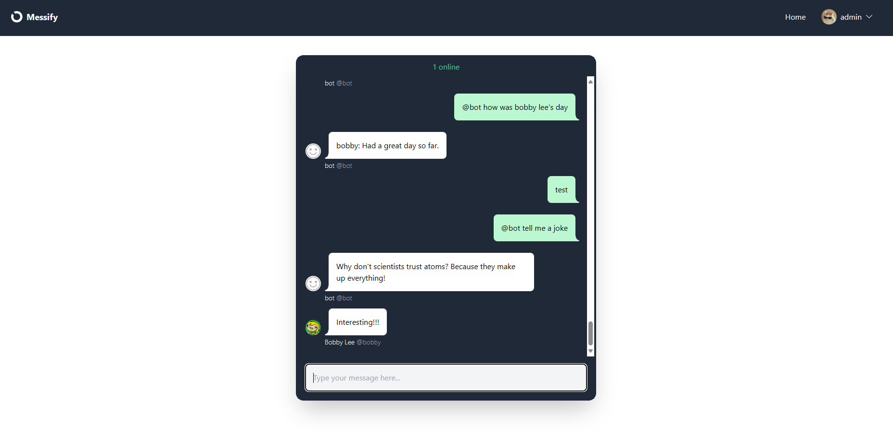

# Messify

## Quick start
1. **Clone the repository:**
    ```bash
    git clone https://github.com/yourusername/messify.git
    cd messify
    ```

2. **Install dependencies:**
    ```bash
    pip install -r requirements.txt
    ```

3. **Create a `.env` file and add your Google API Key:**
    ```
    GOOGLE_API_KEY=your_google_api_key
    ```

4. **Run migrations and create a superuser:**
    ```bash
    python manage.py migrate
    python manage.py createsuperuser
    ```

5. **Start the development server:**
    ```bash
    python manage.py runserver
    ```

6. **Open your browser and visit:**  
    [http://localhost:8000](http://localhost:8000)

## Demo

